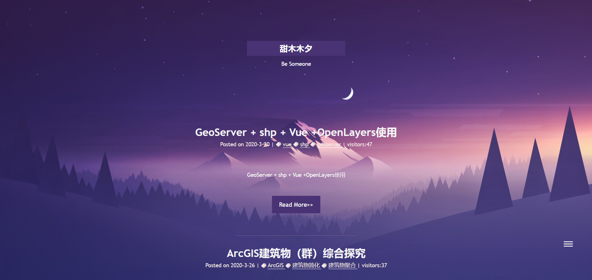
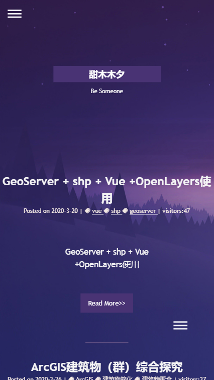
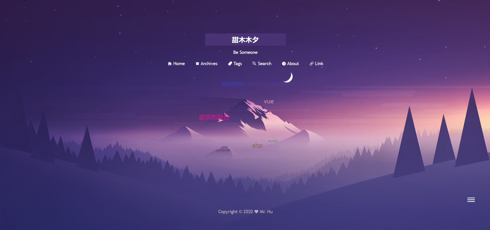
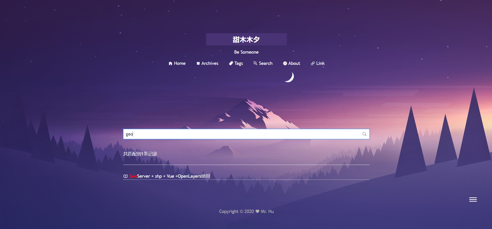
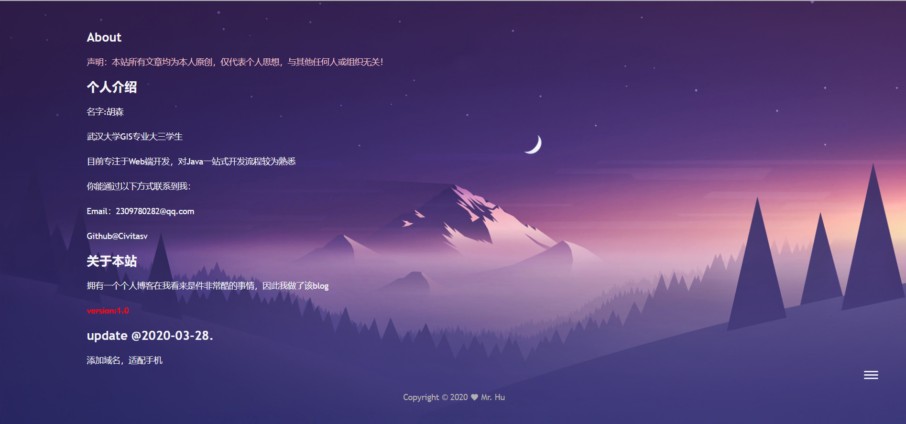
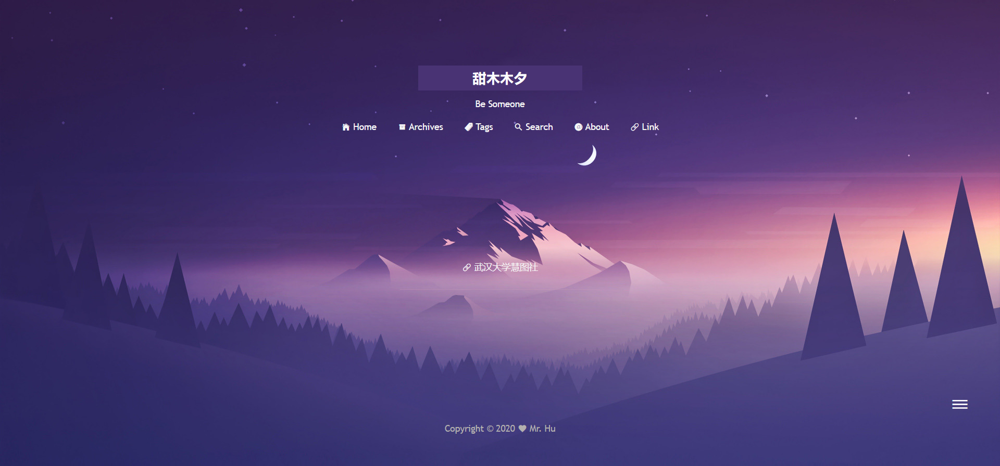

## 个人博客框架

### 一 简介

**主页**：http://starss.me/

**技术选型**：SpringBoot + Vue(Vue cli + Vuex ...) + MySQL

**时间周期**：十天

前后端分离，其中前端部署在GitHub pages，后端部署在阿里云。

### 二 博客页面

博客分为`Home` | `Archives` | `Tags` | `Search` | `About` | `Link` 五个部分。

#### 2.1 Home

**PC**：

**Mobile**：

#### 2.2 Archives

#### 2.3 Tags

#### 2.4 Search

支持关键字查询。

#### 2.5 About

#### 2.6 Link

### 三 后台管理

由于时间原因，目前在后台管理部分仅实现了登陆验证，markdown格式发布，博文管理(增删改查)功能，其余部分将陆续上线。在此不进行展示。

### 四 参考

A. http://codingxiaxw.cn/

B. https://www.myong.top/
